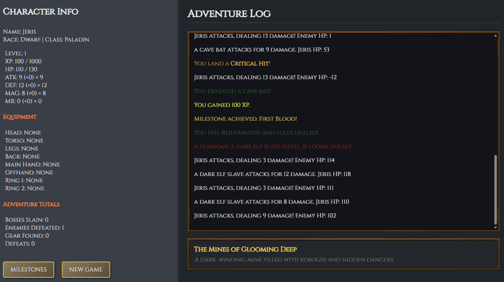

# EverQuest Idle RPG

An idle RPG based on the EverQuest universe. Written in Javascript, CSS and HTML. This code was developed using Microsoft Copilot (AI).

## Table of Contents

- [Features](#Features)
- [Improvements](#Improvements)
- [Installation](#Installation)
- [License](#License)

## Features

- **16 Races and Classes:** All of the EverQuest race and class combinations are available.
- **Pets:** Beastlords, Magicians, and Necromancers can have pets fight for them.
- **Spells:** Bards, Clerics, Druids, Enchanters, Magicians, Necromancers, Paladins, Shadowknights, Shamans, and Wizards can all cast direct damage spells during combat.
- **Boss Encounters:** Bosses will appear occassionally in some zones. Can you handle the challenge?
- **Saved Progress:** Progress is saved to LocalStorage. Be careful when clearing cache or cookies, as it may be removed.
- **Easily Adjustable Content:** Almost everything can be adjusted. HP, ATK, DEF, MAG are all scaled, so that scaling value can be changed to make the game easier or more difficult. Boss encounter rate can be adjusted to fight them more often. Equipment, pets, enemies, spells, etc. can all be updated as well.

## Improvements

Possible future enhancements that could be made.

- **Split JS file:** Split up the JS code into multiple files for easier reading and updating.
- **Offline Progress:** Allow for progress to be made offline.
- **Pets Casting:** Allow pets to cast spells. They already have the MAG stat in their XML to support this.
- **Songs:** Allow bards to play songs.
- **Updated Combat:** Allow pet classes to attack while their pet is alive instead of only if it dies.
- **Better Equipment Handling:** Equipment handling is very basic currently. It is determined soley by the items level. In the future it could be based on a classes needed stats.
- **Images:** Add Character and Enemy Images to the interface.
- **Improved UI:** Update the UI to look better.
- **Flavor Text:** Add to or update the games flavor text.

## Installation

Place the folders and files in your desired web-server directory. Navigate to the index.html to begin playing.

## License

- Public Domain. There is no copyright for this work.
- EverQuest is a trademark or registered trademark of ©2025 Daybreak Game Company LLC.
